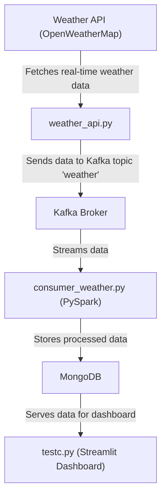

# Real-time Weather Data Analysis using Kafka and PySpark

## Overview
Weather forecasting is a critical challenge with applications in agriculture, government planning, industry, and more. This project demonstrates a real-time weather data analysis pipeline using Kafka for data ingestion, MongoDB for storage, PySpark for stream processing, and Streamlit for dashboard visualization.

## Features
- Real-time ingestion of weather data from OpenWeatherMap API
- Stream processing and analytics using Apache Spark (PySpark)
- Data storage in MongoDB
- Interactive dashboard for visualization using Streamlit

## Architecture


## Prerequisites
- Python 3.7+
- Apache Kafka
- Apache Spark (with PySpark)
- MongoDB
- Required Python packages (see below)

## Setup Instructions
1. **Clone the repository**
   ```bash
   git clone <repo-url>
   cd weather_data_analysis
   ```
2. **Install Python dependencies**
   ```bash
   pip install -r requirements.txt
   ```
   *(If `requirements.txt` is missing, install: pyspark, pymongo, requests, kafka-python, streamlit, pandas)*
3. **Start MongoDB and Kafka services**
   - Ensure MongoDB is running on `localhost:27017`
   - Start Kafka broker on `localhost:9092` and create topic `weather`
4. **Download Spark MongoDB Connector JAR**
   - Place the JAR in a `jars/` directory as referenced in `consumer_weather.py`

## How It Works
- **weather_api.py**: Fetches real-time weather data from OpenWeatherMap and sends it to the Kafka topic `weather`.
- **consumer_weather.py**: Consumes the Kafka stream, processes data with PySpark (including regression analysis), and stores results in MongoDB.
- **testc.py**: Reads processed data from MongoDB and displays it on a Streamlit dashboard.

## Running the Project
1. **Start the Kafka and MongoDB services**
2. **Run the weather data producer**
   ```bash
   python weather_api.py
   ```
3. **Start the PySpark consumer/processor**
   ```bash
   python consumer_weather.py
   ```
4. **Launch the dashboard**
   ```bash
   streamlit run testc.py
   ```

## Example Output
- The dashboard will display a real-time line chart of temperature predictions.

## Troubleshooting
- Ensure all services (Kafka, MongoDB, Spark) are running and accessible.
- Check that the MongoDB URI and Kafka broker addresses match your local setup.

## Credits
- OpenWeatherMap for weather data API
- Apache Kafka, Apache Spark, MongoDB, Streamlit, and all open-source contributors
